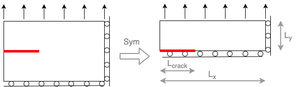

# Computational notebooks — Fracture Mechanics 2026

[](https://github.com/cmaurini/m2-fracture-2026/actions/workflows/test-notebooks.yml)
[](https://codespaces.new/cmaurini/m2-fracture-2026?quickstart=1)
[](https://mybinder.org/v2/gh/cmaurini/m2-fracture-2026/HEAD?labpath=linear-elasticity%2F00-Mesh.ipynb)

Finite element notebooks for the joint Master course in fracture mechanics of
École Nationale des Ponts et Chaussées, Institut Polytechnique de Paris and
Sorbonne Université (MU5MES02 / MEC_53642_EP). They run on
[DOLFINx](https://github.com/FEniCS/dolfinx) **0.11.0**.

## Install

The notebooks need DOLFINx 0.11, gmsh, PyVista and JupyterLab. Follow
the instructions and run the self-test at

**https://github.com/cmaurini/fenicsx-install**

— conda on Linux and macOS, WSL2 + conda on Windows. They produce a conda
environment named `fenicsx-0.11`, which is the one used here.

To run the notebooks without installing anything, see *Run it online* below.

## Run it on your machine

Register the environment once as a Jupyter kernel:

```bash
conda activate fenicsx-0.11
python -m ipykernel install --user --name fenicsx-0.11 --display-name "FEniCSx 0.11"
```

`make kernel` does the same. The notebooks ask for that kernel by name, so from
then on they open on the right environment by themselves, whichever environment
JupyterLab was started from.

```bash
git clone https://github.com/cmaurini/m2-fracture-2026.git
cd m2-fracture-2026
jupyter lab
```

Open `linear-elasticity/00-Mesh.ipynb` and run the cells. The kernel shown in
the top right corner should read *FEniCSx 0.11*. The notebooks import their
helper modules from `utils/` through a relative path, so run them from their
own directory — opening them in JupyterLab does this for you.

## Run it online

Two ways to run the notebooks with nothing installed. Both start the same
image, built from the environment file of the installation instructions above,
so the online environment is the local one.

**GitHub Codespaces** — [open one](https://codespaces.new/cmaurini/m2-fracture-2026?quickstart=1).
A container in the browser, as VS Code or, from its terminal, as JupyterLab.
Files persist from one session to the next, so work in progress survives. It
needs a free GitHub account; the free plan gives 120 core-hours a month — 60
hours on the default two-core machine — and 15 GB of storage. Stop the
codespace when you are done: it is billed on the time it is running, not on the
time you spend in it.

**Binder** — [launch it](https://mybinder.org/v2/gh/cmaurini/m2-fracture-2026/HEAD?labpath=linear-elasticity%2F00-Mesh.ipynb).
No account, one click. Nothing is saved: when the session ends, the edits are
gone with it. The session has 2 GB of memory, is culled after ten minutes of
inactivity, and the first launch is slow while the image is pulled. Use it to
look at the notebooks, not to work in them.

The installation above remains the route for the course itself.

## Contents

| Notebook | What it does |
|---|---|
| [`linear-elasticity/00-Mesh.ipynb`](linear-elasticity/00-Mesh.ipynb) | Builds the mesh of a cracked slab with gmsh, refines it at the crack tip, imports it into DOLFINx, plots it with PyVista and saves it to XDMF. |
| [`linear-elasticity/01-LinearElasticity.ipynb`](linear-elasticity/01-LinearElasticity.ipynb) | Solves plane-stress linear elasticity on that mesh, computes the potential energy and the von Mises stress, plots the deformed configuration, and plots the crack opening and $\sigma_{yy}$ along the line $y=0$. |

The geometry is half of an elastic slab with a straight crack, the half being
taken by symmetry:



Helper modules, imported by the notebooks:

| Module | Contents |
|---|---|
| [`utils/meshes.py`](utils/meshes.py) | `generate_mesh_with_crack`, the mesh of `00-Mesh` as a function. |
| [`utils/plots.py`](utils/plots.py) | `warp_plot_2d`, a PyVista plot of a field on the deformed mesh. |
| [`utils/elastic_solver.py`](utils/elastic_solver.py) | `solve_elasticity`, the whole of `01-LinearElasticity` as a function, returning the displacement, the potential energy and the stress. |
| [`utils/evaluation.py`](utils/evaluation.py) | `evaluate_function`, the values of a finite element function at a set of points. |

Evaluating a field at a set of points — a plot along a line, a value at the
crack tip — is done with `evaluate_function` of `utils/evaluation.py`. It
locates the points in the mesh, evaluates there and gathers the values, so it
works in serial and in parallel. It is a copy of
[`scifem.evaluate_function`](https://scientificcomputing.github.io/scifem/),
carried here so that the notebooks run without scifem installed.

Results are written to `linear-elasticity/output/`, in a form
[ParaView](https://www.paraview.org/) reads.

## Check that it works

```bash
conda activate fenicsx-0.11
make test
```

This executes both notebooks and checks the run: no cell raised, PyVista drew
its figures, and the computed potential energies are the expected ones. The
same two steps run in CI every Monday morning and on every push, on Linux and
macOS in the conda environment of the installation instructions, and in the
image Codespaces and Binder launch.

That image is built by CI from
[`docker/Dockerfile`](docker/Dockerfile), which creates the environment with
`conda env create` from the environment file of
[cmaurini/fenicsx-install](https://github.com/cmaurini/fenicsx-install) — the
one students install. No list of packages is kept here, and
[`tools/check_environment.py`](tools/check_environment.py) imports every
dependency that file names, so a package added there and missing online fails
the build. The image is published to
`ghcr.io/cmaurini/m2-fracture-2026:env-0.11` only after both notebooks have run
in it.

## Further material

- The full notebook collection of the [NEWFRAC](https://www.newfrac.eu) network,
  covering LEFM, plasticity, phase-field and dynamics:
  https://github.com/newfrac/fenicsx-fracture
- The DOLFINx tutorial by Jørgen S. Dokken: https://jsdokken.com/dolfinx-tutorial/
- FEniCS documentation: https://docs.fenicsproject.org/

## Provenance and license

Derived from [newfrac/fenicsx-fracture](https://github.com/newfrac/fenicsx-fracture),
notebooks `notebooks/linear-elasticity/00-Mesh.ipynb` and
`01-LinearElasticity.ipynb` with their helper modules, verified against
DOLFINx 0.11.0.

Authors: Corrado Maurini (Sorbonne Université) and Laura De Lorenzis (ETH Zürich).

MIT, see [LICENSE](LICENSE).
